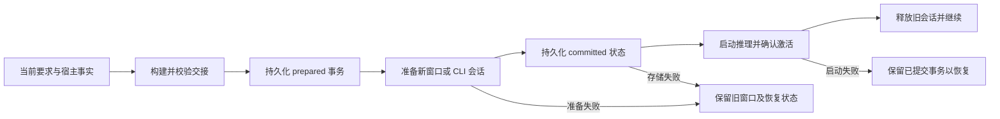
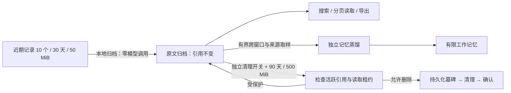

# 上下文与记忆管理

当前实现保留有限窗口、外部原文和按需检索。`RunState.request` 表达当前用户要求，
`WorkSnapshot` 汇总实际完成与缺失事项，操作 journal 提供写入凭据。交接只是这些
事实的投影，不创建第二套任务目标或授权系统。

## 交接与事务

`ContextHandoff`、`WorkingNoteState` 和 `ContextSwitchState` 都带格式版本。绑定
包含 run ID、intent revision、source fingerprint；新执行另用 generation 隔离迟到
回调及工具租约。`context_save` 可补充 `nextAction`、兼容的 `evidenceRefs`、带位置的 `evidence`
和 `sourceProgress`，纯文本笔记
仍兼容。宿主校验笔记版本、引用权限与可读性、执行凭据和待办，缺失时才补充整理。



Native 以检查点提交新窗口，保留最近完整工具交互和必要的 provider replay 信息；
`WindowContext` 等模型响应后记录请求交付。Codex/Kimi 的 prepare-only 启动与推理
分开：准备租约只可初始化 MCP、发现工具目录，不能执行工具；提交后 activate 租约
再调用 `turn/start` 或 `session/prompt`，启动成功才释放旧进程。中断与重启使用同一
事务和已保存 session ID，预算不重置。结果未知的工具及待处理审批阻止切换。

CLI 的目录发现不能错误地要求候选租约已激活。CLI 回传的宿主上下文工具回执保留
真实工具名，流式碎片只进入诊断，避免把保存回执误判为新的业务状态而触发补充。

普通运行、事实与笔记足够的交接新增整理调用为零。每个用户轮次最多一次交接补充，
与蒸馏共享两次宿主维护请求额度；重试计入，旧记录缺少额度时按已用尽恢复。每个
蒸馏批次另持久化总尝试次数，防止新轮次无限重试旧失败。辅助请求使用当前模型、
已声明支持的最低思考档、约 8k 输入、1k 输出、60 秒超时。Native 有 API 输出限制；
CLI 内部提示、重试和未报告用量未知，不能承诺完整账单上限。

## 检索与读取预算

历史与笔记按段、物理页记录及 JSON 对象边界生成可重建片段索引，单片段最多
1,800 个 UTF-16 字符。原文保持不变，JSON 摘录明确是文本片段。片段使用词频、
逆文档频率和长度归一化的 BM25，背景包括已有任务标题、工具名、来源标识和章节；
相关任务只乘以 1.08，不能凭固定加分压过有区分度的证据。中英文沿用本地词项与
汉字二元组，不需要 SQLite 扩展、向量库或模型服务。检索仍扫描本地索引分片，
不是全量语义搜索；大规模档案的延迟需要单独测量。

三种存储分别排序，默认八条按笔记 2、历史 4、记忆 2 分配，空位按 reciprocal rank
互补。去重比较原文版本和片段范围，以及来源身份加完整片段哈希；同一原文的多个
不同片段可以同时返回。摘要围绕命中位置，返回 UTF-16 `offset` / `endOffset`、
可选 `page` / `section`、`sourceVersion`，及父片段起止位置。游标绑定查询、来源范围
和当前索引代次，缓存最多 128 个；资料变化后明确要求重启查询，避免翻页漏项。

`context_read` 与 `context_save evidence` 共用 `readContextEvidence` 的权限、范围和
版本检查。历史版本对应不可变 ref，笔记版本对应修订号，记忆版本对应正文哈希；
这些是归档内容版本，不能冒充当前 PDF 的新鲜度。读取时可传入以下位置对象，保存
时放进 `evidence` 数组。省略 `endOffset` 才继续整条原文；提供区间时到末尾返回 null。

```json
{
  "ref": "h:task:window:item",
  "offset": 24000,
  "endOffset": 24600,
  "sourceVersion": "h:task:window:item",
  "page": 17
}
```

交接先直读明确引用，再以有界的完整下一步查询召回，最多补两条独立待办查询；
来源标识用作过滤，不再拼进交接查询。候选按待办与来源的新增覆盖、独立排名及
片段 token 成本选择。这只是工作集选择线索，不证明语义充分。当前请求、已携带的
笔记前缀不会再作为检索补料重复入窗。正文保留完成凭据、下一步、待办、阶段发现和
精确位置；完整阶段记录另行持久化。只对实际入窗的证据记录交付。

`ToolExecutionContext.outputBudgetTokens` 仅由宿主赋值。统一输入计算保留输出与
max(1000, 窗口容量 10%) 余量，保留实际用量校准。普通并行读取最多四个；工具在
读取前接收页数、文本及整批预算。完整原始结果先存档，超大结构化数据以完整 JSON
读取凭证进入窗口，`nextOffset`/`nextPage` 指向准确续读位置，不截半份 JSON。

新窗口以可用输入的 60% 为目标；必需完整交互可以超过目标，但不能突破硬上限。
交接正文约 2k tokens，其余为可读引用。普通步骤保持提示前缀稳定。物理文件路径、
大小与修改时间可确认一致时才复用普通 PDF 页结果；显式刷新与核验绕过缓存，文件
已变而 reader 仍旧时拒绝旧页面。可观测的“已存档”“已提供给后端／Native 请求”
与业务核验分开；没有核验凭据时保持 unknown。

## 全量任务覆盖

`WorkSnapshot.coverage` 是当前 RunState 来源的派生账，复用宿主归档及笔记元数据。
`context_search {"view":"coverage"}` 按来源分页枚举，并返回已观察页数、截断页数、
下一未读页、模型报告分析和失败项。集合或保存的搜索只代表绑定，成员是否已枚举
完整保持 `collection-members-unknown`，不能靠 Top-K 推断。

可信页面观察只来自带执行绑定的宿主 `get_pages` 原始回执；旧日志、模型文字和
归档回读不创建新读取凭据。`get_pages.sourceVersion` 是已有文件身份信息的摘要，
不会暴露本机路径。不可确认版本时不合并多次读取的页面。更换某个绑定来源使其
记录失效，其他未变来源继续有效；真实读取观察到文件版本变化后，旧页面与支持
旧分析的证据过时。用户意图更新后，分析报告需要重新确认。

`context_save.sourceProgress` 接受 `analyzed` / `failed`；analyzed 要求本次笔记附有
对应来源的可读证据。它是模型报告，不能把 `verification:unknown` 改成已核验。
复用同一进度笔记不抹去其他来源的已报告进度；原始保存回执落盘后，阶段记录链接
到不可变历史，保持旧阶段可回读。来源签名只保存相关条目，避免每次读取复制整份
材料清单。活跃任务的笔记和覆盖账引用也参与归档删除保护。

普通步骤维持稳定提示与工具目录。共享上下文说明删除重复指导；新增可选字段确实
增加固定 schema tokens，必须与读取节省分别核算。没有逐步摘要、额外语义模型、
递归子模型或新目标系统。

## 热记录、归档、蒸馏、删除



归档前等待原文与索引持久化，保留现有文件与引用，释放重复日志、已结束的运行时、
内存工作副本和可再生的执行投影，权威回执独立保留。`projectionPending` 使中断的
归档收尾可恢复。重新继续任务加载交接和所需片段，不灌回整份历史。

归档 TTL 从 archivedAt 起算，实际非空读取或继续更新 lastReadAt；搜索、诊断导出、
后台蒸馏不续期。容量按正文、索引分片、清单及历史清单备份的字节数计算，增量更新，
维护不反复扫描原文。到期或超容量按最久未使用排序。活跃／待恢复任务依赖、读取
租约、交接事务及未决操作受保护；受保护记录允许临时超限，历史详情解释原因。

蒸馏最多选取 32 个分布在不同窗口与来源的片段，总输入受限；普通记忆继续使用
200 条／16k 正文 tokens 的限制，保护记忆与知识库保持原权限语义。蒸馏成功、失败、
额度不足均不授权删除归档。真正删除只由保留策略或用户删除决定，先持久化墓碑，
再删除原文和派生索引，保留中断恢复标记。用户成果、知识库和权威写入凭据独立。

## 存储与迁移

复用任务 schema 4 与 history index version 1，以可选字段兼容旧记录。首次加载
保存任务状态和历史清单备份，只补元数据、字节统计和每窗口词项分片，不删除原文。
清单及分片缓存各限 16 项、16 MiB 序列化体积（不是实际堆内存上限）；原文仍是同一
不可变文件。旧词项分片在首次使用时逐窗口升级为 version 2 片段索引，提交失败可
重试补齐计数；升级不调用模型、不删除正文。旧已清理记录维持不可恢复状态。
首次迁移的全局任务状态备份与旧 runtime 目录副本是独立恢复副本，不计入 500 MiB
归档额度，也不随自动归档删除。旧目录清理由显式删除任务触发，仍先验证原件未变且
当前目录具有有效替代文件；用户成果不在该清理范围。

新增 `historyAutoCleanup` 与原有自动记忆选择独立。旧用户显式 memoryConsent=off，
或旧式显式关闭 memoryAutoExtract 且未设置 consent，迁移时保持历史自动清理关闭；
新用户保留默认开启。UI 显示近期／已归档／已清理、保留原因、归档占用与维护额度。

实现主要位于 `AgentHost`、`ContextHandoff`、`ContextTools`、`HistoryStore`、
`WindowContext` 与 `PluginRuntimeHost`。流程图源文件见
[可生成的架构图](diagrams/context-system.architecture.json)。
本轮优化见[上下文优化验收](acceptance/context-optimization-2026-09-08.md)。
前一阶段结果见[完整修复验收](acceptance/context-system-repair-2026-09-08.md)。
早期验收记录保留为各自源码状态的历史证据，不代表当前删除策略。
