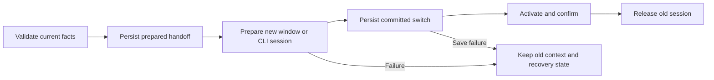

# Context and retention contracts

English · [简体中文](context-memory-refactor.zh-CN.md)

[Maintainer guide](README.md) · [User guide](../../docs/context-system.md)

## Facts and handoffs

`RunState.request` owns the current requirement, `WorkSnapshot` owns domain
completion facts, and the operation journal owns write evidence. A handoff is a
projection of these facts, not a new goal or authorization system.

Handoffs bind run ID, intent revision and source fingerprint. Execution generation
separately fences late callbacks. Working notes may include `nextAction`,
`evidence` and `sourceProgress`; old plain-text notes remain supported.

Context tools capture ownership and scope at admission and recheck after joining
the storage queue and at write boundaries. Committed writes retain their receipts
even if cancellation follows.

```mermaid
flowchart LR
  A[Validate current facts] --> B[Persist prepared handoff]
  B --> C[Prepare new window or CLI session]
  C --> D[Persist committed switch]
  D --> E[Activate and confirm]
  E --> F[Release old session]
  C -->|Failure| R[Keep old context and recovery state]
  D -->|Save failure| R
```

Native commits a checkpoint with complete tool interactions and compatible replay
data. External prepare-only leases allow initialization/catalogue discovery, not
tool execution. Activate only after commit; release the old process only after
successful activation. Unknown effects or pending approvals block switching.
Recheck generation after each persistence boundary.

A complete handoff adds no organizing request. Missing information permits one
supplement, shared with research extraction and distillation under **two host
maintenance requests per user turn**. Retries consume the allowance; restart
does not refill it. Old records lacking allowance evidence recover conservatively.
Use the current model and supported lowest thinking level; target about 8k input,
1k output tokens and 60 seconds. Unreported CLI usage stays unknown.

## Retrieval and evidence

`context_search`, `context_read`, `context_save` and `new_context` share
scope, version and budget rules. Compatibility note writes use the same boundary.

- Local BM25 indexes passages at paragraph, page and JSON-object boundaries,
  with Chinese bigrams and a maximum passage size of 1,800 UTF-16 units.
- The default eight results allocate two notes, four history passages and two
  memories; unused slots are shared by rank.
- Query cursors bind query, source scope, task and index generation. Source
  changes invalidate pagination rather than mixing versions.
- Reads and saved evidence validate the same ref, version and offset range.
  Offsets are UTF-16 units; archived content versions do not prove current PDF freshness.
- Full tool results are archived before bounded excerpts enter the model.
  Oversized JSON stays complete behind a read reference; pagination must not
  return half a JSON value.
- Explicit refresh and verification bypass normal PDF reuse. File changes
  invalidate cached pages; a stale reader must not supply old content.

The host supplies output budgets. Reserve output plus at least the larger of
1,000 tokens or 10% of the window. A new working window targets 60% of usable
input without breaking complete required interactions or the hard ceiling.
Ordinary parallel reads are capped at four.

## Coverage is not verification

`context_search { "view": "coverage" }` derives per-source observed pages,
truncation, next unread page, model-reported analysis and failures.

Only scoped `get_pages` receipts establish page observations. Re-reading an
archive, model prose or old logs cannot forge a new source read. Collection
membership remains unknown until enumerated. Changed sources invalidate their
own evidence; user-intent changes require analysis to be reconsidered.

`context_save.sourceProgress` may report analyzed/failed state with matching,
readable evidence. It does not turn unknown factual verification into success.

## Retention is independent of distillation

| Material       | Default policy                                                             |
| -------------- | -------------------------------------------------------------------------- |
| Recent history | 10 ended tasks / 30 days / 50 MiB targets                                  |
| Archive        | 90 days / 500 MiB targets; refs stay unchanged                             |
| Work memory    | 200 records / about 16k body tokens; ordinary inactivity expiry at 90 days |

Archive movement is local and requires durable originals/indexes. Pending
projection cleanup is resumable. Actual nonempty reads or continuation renew
archive use; search, diagnostic export and background maintenance do not.

Before deleting, honor active/recoverable task references, read leases, handoff
transactions and unresolved operations. Persist tombstones first, then remove
originals/indexes and finish recovery markers. Protected material may exceed
capacity temporarily. Distillation success or failure never authorizes deletion.

Protected memory and active topics avoid ordinary expiry but still count toward
capacity. Forget excludes source tasks from future distillation. Reports, native
Zotero data and authoritative receipts remain separate.

## Storage and migration

Keep task schema 4 and history index version 1 compatible through optional fields.
Initial migration backs up state and adds metadata/indexes without deleting text.
Passage-index upgrades are local and resumable.

Archive capacity includes originals, index shards, manifests and manifest backups.
Initial global backups, legacy runtime copies, CLI logs and user exports are
separate. Explicit task deletion may clean validated unchanged legacy copies;
automatic archive cleanup does not erase migration backups.

`historyAutoCleanup` is independent of automatic memory. Preserve an old user's
explicit disabled-memory choice when migrating the new cleanup preference.
Source refresh and all memory mutations share the queue and reread disk before
honoring protection, correction or deletion.

See [knowledge contracts](knowledge.md), [runtime contracts](runtime.md) and
the [historical archive](acceptance/README.md).
