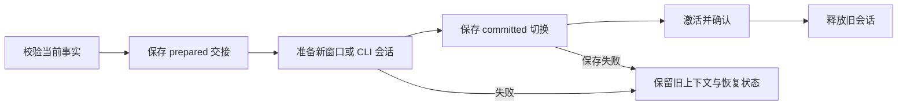

# 上下文与保留契约

[English](context-memory-refactor.md) · 简体中文

[维护者指南](README.zh-CN.md) · [使用指南](../../docs/context-system.zh-CN.md)

## 事实与交接

`RunState.request` 保存当前要求，`WorkSnapshot` 保存领域完成事实，
操作日志保存写入凭据。交接只是这些事实的投影，不另建目标或授权系统。

交接绑定 run ID、意图修订和来源指纹，执行代次另外隔离迟到回调。
工作笔记可带 `nextAction`、`evidence` 和 `sourceProgress`，
旧纯文本笔记仍兼容。

上下文工具在准入时固定归属与范围，进入存储队列后及写入前再次检查。
已经提交的写入保留回执，不能因随后取消改报未生效。

Native 提交包含完整工具交互与兼容回放信息的 checkpoint。
外部 prepare-only 租约只允许初始化和目录发现，不能执行工具；
提交后才激活，激活成功后才释放旧进程。
未知效果和待审批状态阻止换窗，每次持久化后重新检查执行代次。

完整交接不增加整理调用。缺信息时最多补充一次，
与研究提取、蒸馏共用**每个用户轮次两次宿主维护请求**。
重试计入，重启不补额度；旧记录缺少额度证据时保守恢复。
沿用当前模型与已支持的最低思考档，目标约 8k 输入、1k 输出 tokens、60 秒。
CLI 未报告用量保持未知。

## 检索与证据

`context_search`、`context_read`、`context_save`、`new_context`
共用范围、版本与额度规则，兼容笔记写入遵守同一边界。

- 本地 BM25 按段落、物理页和 JSON 对象分片，支持中文二元组，
  单片段最多 1,800 个 UTF-16 单元。
- 默认八条分配为笔记二、历史四、记忆二，空位按排名互补。
- 游标绑定查询、来源范围、任务和索引代次；来源变化使分页失效，不能混合版本。
- 读取与保存证据共用 ref、版本和位置校验。偏移以 UTF-16 计，
  归档版本不能证明当前 PDF 新鲜度。
- 完整工具结果先归档，再将有界摘录交给模型；
  超大 JSON 通过读取引用保留完整内容，分页不能返回半个 JSON 值。
- 显式刷新与核验绕过普通 PDF 复用；文件变化使缓存失效，旧 reader 不能提供陈旧页面。

输出额度由宿主提供。预留模型输出及不小于 1,000 tokens 或窗口 10% 的余量。
新窗口目标为可用输入的 60%，保留必需的完整交互且不突破硬上限。
普通并行读取最多四个。

## 覆盖不等于核验

`context_search { "view": "coverage" }` 按来源派生已观察页数、
截断情况、下一未读页、模型报告分析和失败项。

只有带范围的 `get_pages` 回执建立页面观察。
归档回读、模型文字和旧日志不能伪造新的来源读取；
未枚举的集合成员保持未知。来源变化使对应证据失效，
用户意图变化后需要重新判断分析是否适用。

`context_save.sourceProgress` 可带可读证据报告 analyzed / failed，
不能把未知事实核验改为成功。

## 保留与蒸馏独立

| 内容     | 默认规则                                        |
| -------- | ----------------------------------------------- |
| 近期历史 | 10 个已结束任务／30 天／50 MiB 目标             |
| 归档     | 90 天／500 MiB 目标，引用不变                   |
| 工作记忆 | 200 条／正文约 16k tokens，普通闲置过期为 90 天 |

本地归档需先持久化原文与索引，投影清理中断后可恢复。
实际非空读取或继续任务会续期；搜索、诊断导出和后台维护不会。

删除前检查活跃／待恢复任务引用、读取租约、交接事务和未决操作。
先保存墓碑，再删原文与索引，最后完成恢复标记；
受保护内容可暂时超限。蒸馏成功或失败都不授权删除。

受保护记忆与活跃课题不按普通闲置淘汰，但计入容量；
忘记会阻止来源任务后续蒸馏。报告、原生 Zotero 数据和权威回执独立保留。

## 存储与迁移

使用可选字段兼容任务 schema 4 和 history index version 1。
首次迁移备份状态，仅补元数据和索引，不删正文；片段索引升级在本地可恢复执行。

归档容量包含原文、索引分片、清单及清单备份。
初始全局备份、旧 runtime 副本、CLI 日志及用户导出独立保留。
显式删除任务可清理已校验且未变的旧副本，自动归档清理不删除迁移备份。

`historyAutoCleanup` 与自动记忆独立；
迁移新清理偏好时尊重旧用户显式关闭记忆的选择。
来源刷新与记忆变更共用队列，写入前重读磁盘以尊重保护、纠正和删除。

另见[知识契约](knowledge.zh-CN.md)、[运行时契约](runtime.zh-CN.md)
和[历史归档](acceptance/README.zh-CN.md)。
